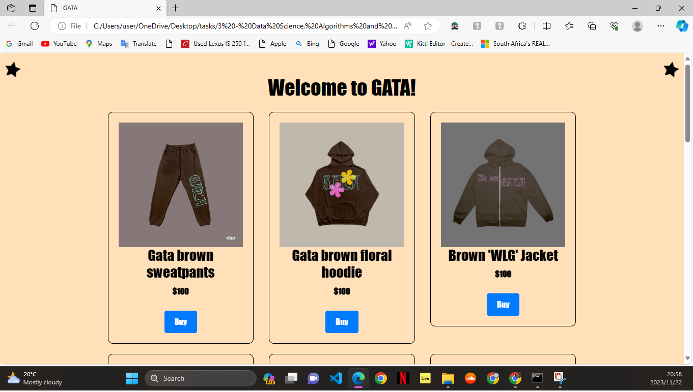

# Bootstrap Shopping Page

## Description

This project provides a web page built using HTML and CSS with the Bootstrap framework. It features a product listing for GATA, a fashion brand, with a responsive design and various UI components styled using Bootstrap.

## Table of Contents

- [Installation](#installation)
- [Usage](#usage)
- [Credits](#credits)
- [Contact](#contact)
- [License](#license)

## Installation

To install and run this project locally, follow these steps:

1. Clone the repository to your local machine:

    ```bash
    git clone https://github.com/your-username/Bootstrap-Shopping-Page.git
    ```

2. Open the project directory:

    ```bash
    cd Bootstrap-Shopping-Page
    ```

3. Open the `index.html` file in your preferred web browser.

## Usage

After installing the project, you can navigate to the `index.html` file in your web browser to view the Bootstrap Shopping Page. The web page includes a product listing, responsive design, and various Bootstrap components for styling.

### Screenshots


*The index.html will land you on this page and you are free to browse!*


## Credits

This project was created by:

- **Adriano Mama**
  - GitHub: [AdrianoMama](https://github.com/Adryanoblase)

## Contact

If you have any questions or feedback regarding this project, feel free to contact the author:

- **Name:** Adriano Mama
- **Email:** adrianoblase99@gmail.com

## License

© 2023 Adriano Mama. All rights reserved.
